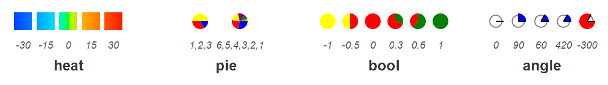
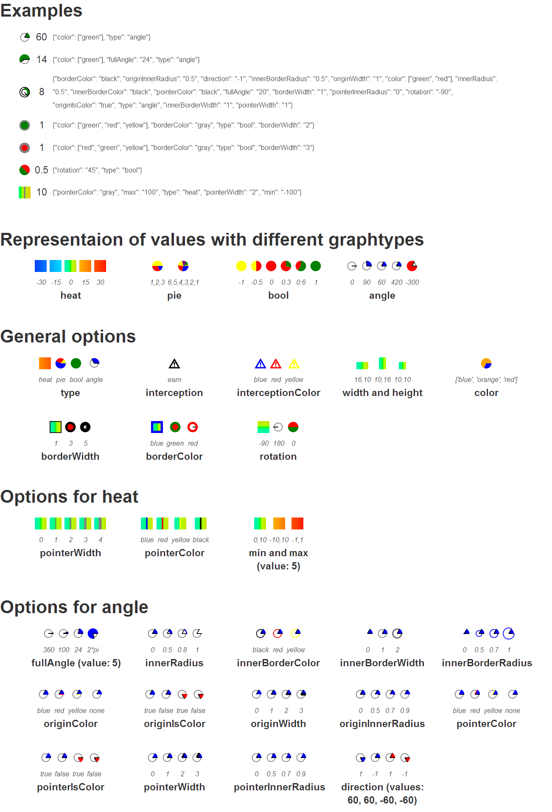

inlinegraph
===========
if you want to use this library, you can simply copy this javascript file to your project: [inlinegraph.js](./docs/inlinegraph.js).

You can see how to integrate the inlinegraph library based on this example:
- [code](./docs) 
- [webview](https://tmunz.github.io/inlinegraph)

All graphs are based on SVG and can be created by using 
$(selector).inlinegraph(values, options);

values
------
To use the content of the tag as parameter, use 'html' as value. If you want to use more values, split them by using comma (","). If the value is not a number, a interception-graphic will be displayed.

options
-------
A json object is required, as you can see in the examples

